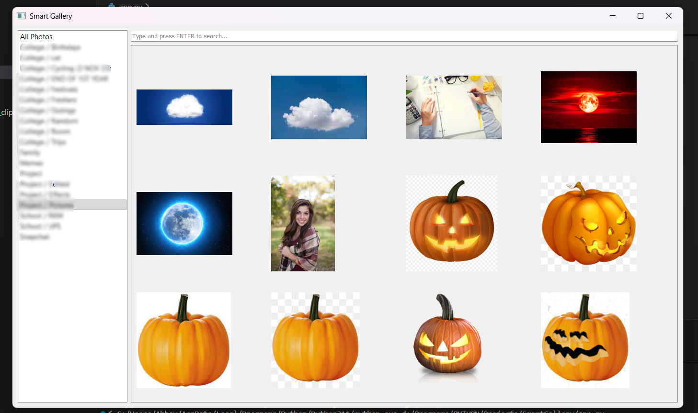
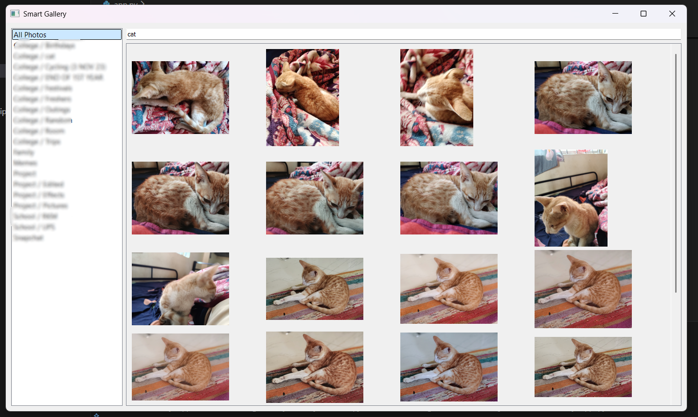
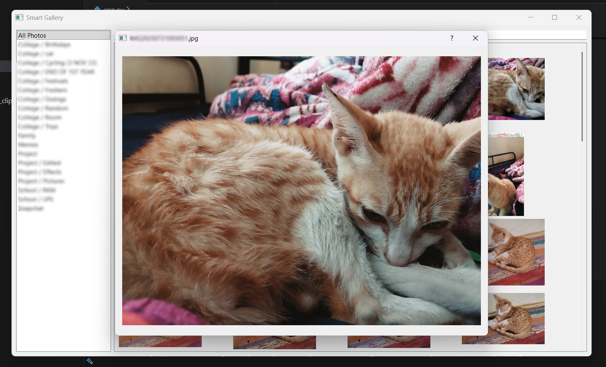

# SmartGallery

A sophisticated AI-powered image gallery application that enables intelligent searching through your photo collection using natural language queries. SmartGallery combines computer vision, embeddings, and a user-friendly desktop interface to organize and discover images effortlessly.

## Features

- **AI-Powered Search**: Search images using natural language descriptions powered by CLIP embeddings
- **Automatic Captions**: Generate descriptive captions for images using Vision Encoder-Decoder models
- **Smart Tagging**: Automatically extract relevant tags from image captions using KeyBERT
- **Album Organization**: Organize images into albums based on folder structure
- **Infinite Scroll**: Smooth loading of image thumbnails with infinite scroll functionality
- **Full-Screen Viewer**: View images in a dedicated full-screen dialog
- **Real-Time Updates**: Monitor directories for new/deleted images and update embeddings on the fly
- **GPU Support**: Utilizes CUDA for faster processing when available

## Demo & Screenshots

### Main Gallery View
Shows album-based navigation with infinite scrolling thumbnails.



---

### AI Search Results
Natural language search example using query **"cat"** filtered inside albums.



---

### Full Image Viewer
Click any image to open it in a full-size dedicated viewer.




## Architecture

SmartGallery uses a multi-process architecture for optimal performance:

1. **Main Application** (`app.py`): PyQt5-based GUI for browsing and searching
2. **Search Server** (`search_server.py`): Handles AI-powered image search queries
3. **Encoder Server** (`encoder_server.py`): Generates embeddings for new images in real-time
4. **Pipeline** (`image_captioning_clip_pipeline.py`): Preprocessing script to generate captions and embeddings

## System Requirements

### Dependencies

- Python 3.8+
- PyQt5: Desktop GUI framework
- PyTorch: Deep learning framework
- CLIP: Multi-modal embeddings
- FAISS: Efficient similarity search
- Transformers: Pre-trained models
- KeyBERT: Keyword extraction
- NumPy, Pandas, Pillow: Data processing

### Hardware

- GPU with CUDA support (optional but recommended)
- Minimum 8GB RAM for processing large image collections
- SSD storage for faster image loading

## Installation

### Step 1: Clone the Repository

```bash
git clone https://github.com/Uni-Creator/SmartGallery.git
cd SmartGallery
```

### Step 2: Install Dependencies

```bash
pip install -r requirements.txt
```

### Step 3: Prepare Your Data

Organize your images in a folder structure:

```
PHOTOS/
├── Category1/
│   ├── Folder1/
│   │   ├── image1.jpg
│   │   └── image2.jpg
│   └── Folder2/
│       └── image3.jpg
└── Category2/
    └── image4.jpg
```

### Step 4: Generate Initial Embeddings

Before running the application, generate embeddings for your images:

```bash
python image_captioning_clip_pipeline.py
```

This will:
- Generate captions for each image
- Extract tags from captions
- Create CLIP embeddings for both images and captions
- Save outputs to the `data/` and `embeddings/` directories

### Step 5: Run the Application

```bash
python app.py
```

Update the `BASE_FOLDER` variable in `app.py` to point to your photo collection:

```python
BASE_FOLDER = r"D:\Your\Photo\Path"  # Update this path
```

## Usage

### Basic Navigation

1. **Browse Albums**: Select albums from the left sidebar to view grouped images
2. **View Thumbnails**: Scroll through image thumbnails in a 4-column grid
3. **Open Full Image**: Click any thumbnail to view the full-resolution image

### AI Search

1. Enter a natural language query in the search box (e.g., "sunset over water", "people at beach")
2. Press ENTER to search
3. Results will be filtered from the current album
4. Clear the search box and press ENTER to show all images again

### Supported Image Formats

- JPG/JPEG
- PNG
- BMP
- WebP

## Project Structure

```
SmartGallery/
├── app.py                                   # Main PyQt5 GUI application
├── search_server.py                         # Search query processing server
├── encoder_server.py                        # Real-time embedding encoder
├── image_captioning_clip_pipeline.py        # Preprocessing pipeline
├── text_search.py                           # Search engine logic
├── pre-processing.py                        # Data preprocessing utilities
├── requirements.txt                         # Python dependencies
├── data/
│   ├── final_cleaned_data.csv              # Original image metadata
│   └── images_with_captions_and_tags.csv   # Captions and tags
└── embeddings/
    ├── image_embeddings.npy                # Raw image embeddings
    ├── image_embeddings_normalized.npy     # Normalized image embeddings
    ├── caption_embeddings.npy              # Caption embeddings
    └── image_faiss_index.idx               # FAISS index for fast search
```

## Key Components

### ThumbnailWorker (app.py)
Asynchronous background worker for generating and caching image thumbnails to prevent UI freezing.

### GalleryWindow (app.py)
Main PyQt5 window managing:
- Album selection and navigation
- Grid layout with infinite scroll
- Search interface
- Subprocess management (search & encoder servers)

### CLIPSearchEngine (text_search.py)
Handles semantic search using CLIP embeddings with configurable similarity thresholds.

### ImageEncoderServer (encoder_server.py)
Real-time service that:
- Listens for new image paths
- Generates embeddings using CLIP
- Updates FAISS index
- Maintains metadata CSV files

## Configuration

### Adjusting Search Sensitivity

In `text_search.py`, modify the alpha parameter in the search methods to adjust filtering sensitivity.

### Thumbnail Size

Edit in `app.py` `ThumbnailWorker.process_queue()`:
```python
image = image.scaled(200, 200, ...)  # Adjust dimensions
```

### Grid Layout

Modify in `app.py` `load_batch()`:
```python
if col >= 4:  # Change 4 to desired columns per row
```

### Batch Size

In `app.py` `GalleryWindow.__init__()`:
```python
self.batch_size = 100  # Images loaded per scroll
```

## Performance Tips

1. **Use GPU**: Ensure CUDA is properly installed for ~5-10x faster processing
2. **Normalize Embeddings**: Pre-normalized embeddings improve search speed
3. **FAISS Optimization**: For large collections (>100k images), consider GPU-accelerated FAISS
4. **Caching**: Thumbnails are cached in memory; increase batch size for slower systems

## Troubleshooting

### Search Server Not Starting
- Verify `search_server.py` can run independently: `python search_server.py`
- Check that embeddings files exist in `embeddings/` directory

### Out of Memory Errors
- Reduce `BATCH_SIZE` in `image_captioning_clip_pipeline.py`
- Process images in smaller chunks
- Reduce thumbnail batch size

### CUDA Not Available
- Install PyTorch with CUDA support: `pip install torch torchvision torchaudio --index-url https://download.pytorch.org/whl/cu118`
- Verify NVIDIA drivers are installed

### Missing Embeddings
- Run `image_captioning_clip_pipeline.py` to generate missing embeddings
- Ensure CSV file paths are correct

## Future Enhancements

- [❌] Multi-threaded image processing pipeline
- [❌] Web-based interface (Flask/React)
- [✅] Batch image uploading with automatic processing
- [❌] Advanced filtering and faceted search
- [❌] Image clustering and recommendations
- [❌] Database backend (PostgreSQL + pgvector)
- [❌] REST API for programmatic access
- [❌] Image deduplication detection
- [❌] Automatically remove deleted image's embeddings

## License

This project is licensed under the MIT License. See the LICENSE file for details.

## Contributing

Contributions are welcome! Please feel free to submit pull requests or open issues for bugs and feature requests.

## Support

For issues, questions, or suggestions, please open an issue on the [GitHub repository](https://github.com/Uni-Creator/SmartGallery).

## Acknowledgments

- [OpenAI CLIP](https://github.com/openai/CLIP) for multi-modal embeddings
- [Facebook FAISS](https://github.com/facebookresearch/faiss) for efficient similarity search
- [PyQt5](https://www.riverbankcomputing.com/software/pyqt/) for the GUI framework
- [Hugging Face Transformers](https://huggingface.co/transformers/) for pre-trained models
